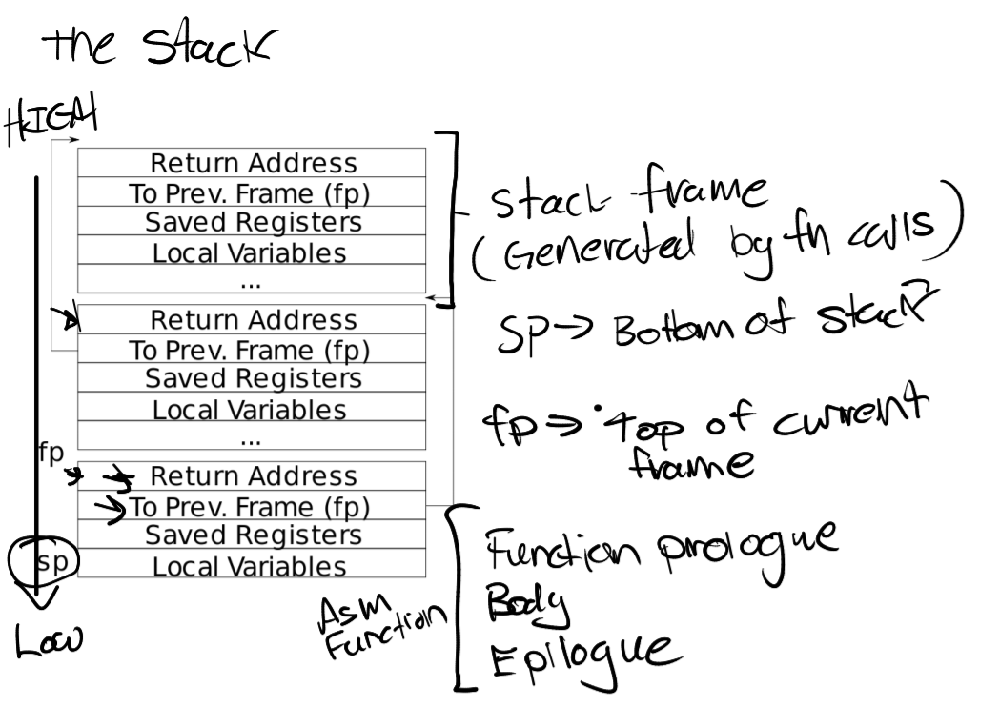
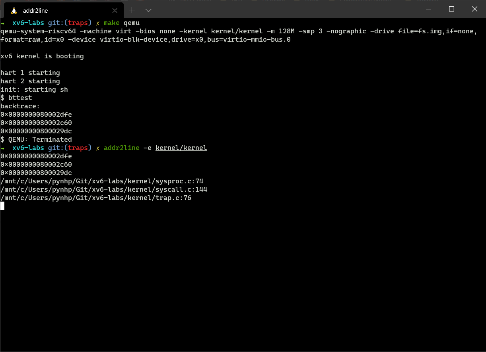
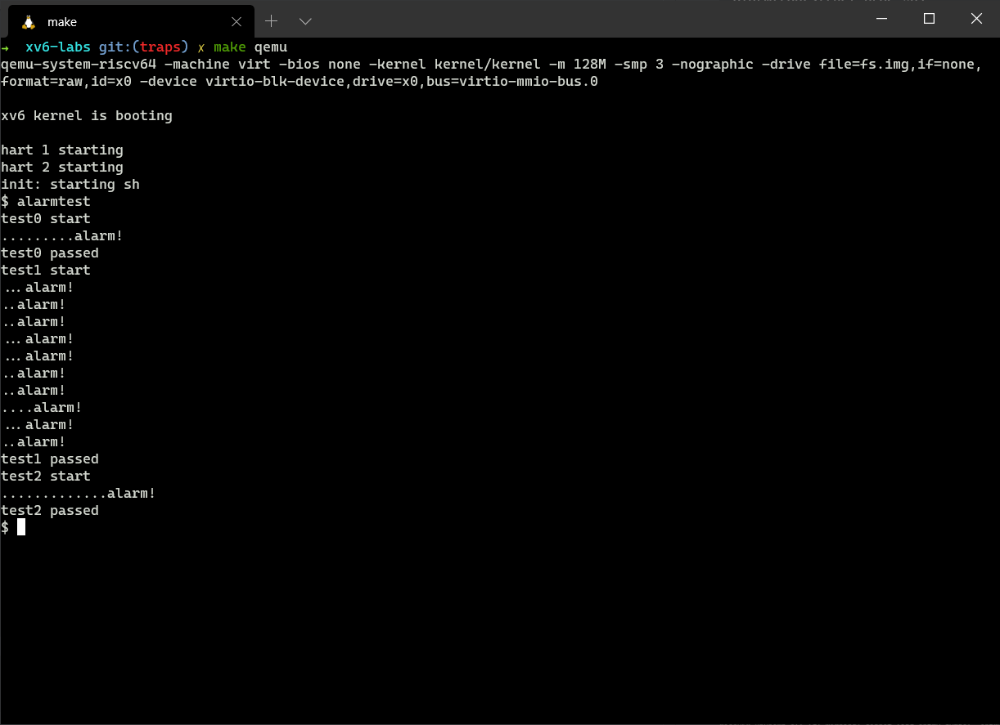

# Lab 3: Traps 实习报告

| 姓名 | 学号 | 日期 |
| --- | --- | --- |
| 枚辉煌 | 1800094810 | 2021/03/30 |

- [Lab 3: Traps 实习报告](#lab-3-traps-实习报告)
  - [1. 实验总结](#1-实验总结)
    - [Exercise 1: RISC-V Assembly](#exercise-1-risc-v-assembly)
    - [Exercise 2: Backtrace](#exercise-2-backtrace)
    - [Exercise 3: Alarm](#exercise-3-alarm)
    - [Result](#result)
  - [2. 遇到的困难以及收获](#2-遇到的困难以及收获)
  - [3. 对课程或Lab的意见和建议](#3-对课程或lab的意见和建议)
  - [4. 参考文献](#4-参考文献)

## 1. 实验总结

### Exercise 1: RISC-V Assembly

1, Q: Which registers contain arguments to functions? For example, which register
holds 13 in main's call to `printf`?

A: Registers `a0`-`a7` contain arguments for function. Register `a2` holds 13 in main's call to `printf`

2, Q: Where is the call to function `f` in the assembly code for main? Where is the call to `g`?

A: No call to function f in main and no call to g in f, compiler optimized these calls.
Compiler calculated `f(8)+1 = 12` then pass it to `printf` (`li a1, 12`)

3, Q: At what address is the function `printf` located?

A: `printf` at address `0x630`

4, Q: What value is in the register `ra` just after the `jalr` to `printf` in main?

A: `ra = 0x30`

5, Q: Run the following code.
```c
	unsigned int i = 0x00646c72;
	printf("H%x Wo%s", 57616, &i);
```  
What is the output?

The output depends on that fact that the RISC-V is little-endian. If the RISC-V were instead big-endian what would you set i to in order to yield the same output? Would you need to change 57616 to a different value?

A: output: HE110 World, because 57616 = 0xE110, and 0x00646c72 map to ASCII is: 64 = d, 6c = l, 72 = r.
Because RISC-V is little-endian, so `printf("%s", &i)` should print "rld"
If RISC-V is big-endian, `i` should be 0x726c6400, we don't need to change 57616 because its hex value does not change

6, Q: In the following code, what is going to be printed after `y=`? (note: the answer is not a specific value.) Why does this happen?
```c
	printf("x=%d y=%d", 3);
```  

A: The answer is a random value because `printf` just takes value in register a1 as second argument
but does not know if users passed it or not, so whatever value is in `a1` will be printed out

### Exercise 2: Backtrace

Solution: Read frame pointer in register `s0` and walk up the stack and print the saved return address in each stack frame until there is no more caller.

- Add `backtrace` prototype in `kernel/defs.h:83`
```c
// kernel/defs.h:83
void            backtrace(void);
```
- Add `r_fp` function to read frame pointer in `s0`
```c
// kernel/riscv.h
static inline uint64
r_fp()
{
  uint64 x;
  asm volatile("mv %0, s0" : "=r" (x) );
  return x;
}
```
- Page 3 in lecture notes from MIT describes the layout of stack frame. Return address lives at offset -8 from `fp` and saved frame pointer lives at offset -16.



- Implement `backtrace` in `kernel/printf.c`. `backtrace` reads frame pointer of current function `fp`, gets value of return address and saved frame pointer in `(fp-8)` and `(fp-16)` and loops until there's no more stack frame.

```c
void
backtrace(void)
{
  uint64 fp; // frame pointer
  uint64 sfp; // saved frame pointer
  uint64 ra; // return address

  printf("backtrace:\n");
  for (fp = r_fp(); PGROUNDUP(fp) != PGROUNDDOWN(fp); fp = sfp)
  {
    ra = *(uint64*)(fp-8);
    sfp = *(uint64*)(fp-16);
    printf("%p\n", ra);
  }
}
```
- Add `backtrace` to `sys_sleep` for `bttest`
```c
// kernel/sysproc.c
uint64
sys_sleep(void) 
{
  ...
  release(&tickslock);
  backtrace();
  return 0;
}
```
- `bttest` output



### Exercise 3: Alarm

Solution: Alarm behavior is similar to handling timer interrupt with a few differences:
- Alarm timer can be customized
- When timer interrupt occurs, scheduler switchs to other processes and then resume the process at where it interrupted. In alarm interrupt, process should start executing at alarm handler, when alarm handler returns the process resumes at the point alarm interrupted.

So the process structure should have a way of managing the alarm timer and saving contexts before executing alarm handler.

- Firstly, we add two new syscalls `sigalarm` and `sigreturn`.
```c
// user/user.h
...
int sigalarm(int ticks, void(*handler)());
int sigreturn(void);

// user/usys.pl
...
entry("sigalarm");
entry("sigreturn");

// kernel/syscall.h
#define SYS_sigalarm  22
#define SYS_sigreturn 23

// kernel/syscall.c
...
extern uint64 sys_sigalarm(void);
extern uint64 sys_sigreturn(void);
...
static uint64 (*syscalls[])(void) = {
  ...
  [SYS_sigalarm]  sys_sigalarm,
  [SYS_sigreturn] sys_sigreturn,
}
```
- To save alarm information such as alarm interval and alarm handler, we introduce 3 new fields in `struct proc`
```c
// kernel/proc.c
struct proc {
  ...
  int alarm_passed;           // Ticks passed since last alarm
  int alarm_interval;
  uint64 alarm_handler;        // Virtual address point to alarm handler function
}
```

- Initialize these values when creating process
```c
// kernel/proc.c
static struct proc*
allocproc(void)
{
  ...
  // Init for alarm syscall
  p->alarm_passed = 0;
  p->alarm_interval = 0;
  p->alarm_handler = 0;

  return p;
}
```
- Besides, we introduce `struct alarmframe` to save contexts of process before executing alarm handler. `struct alarmframe` is identical with `struct trapframe` because these twos save all necessary information for resuming process's execution after an interrupt.
```c
// kernel/proc.h
struct alarmframe {
  /*   0 */ uint64 kernel_satp;   // kernel page table
  /*   8 */ uint64 kernel_sp;     // top of process's kernel stack
  /*  16 */ uint64 kernel_trap;   // usertrap()
  /*  24 */ uint64 epc;           // saved user program counter
  /*  32 */ uint64 kernel_hartid; // saved kernel tp
  /*  40 */ uint64 ra;
  /*  48 */ uint64 sp;
  /*  56 */ uint64 gp;
  /*  64 */ uint64 tp;
  /*  72 */ uint64 t0;
  /*  80 */ uint64 t1;
  /*  88 */ uint64 t2;
  /*  96 */ uint64 s0;
  /* 104 */ uint64 s1;
  /* 112 */ uint64 a0;
  /* 120 */ uint64 a1;
  /* 128 */ uint64 a2;
  /* 136 */ uint64 a3;
  /* 144 */ uint64 a4;
  /* 152 */ uint64 a5;
  /* 160 */ uint64 a6;
  /* 168 */ uint64 a7;
  /* 176 */ uint64 s2;
  /* 184 */ uint64 s3;
  /* 192 */ uint64 s4;
  /* 200 */ uint64 s5;
  /* 208 */ uint64 s6;
  /* 216 */ uint64 s7;
  /* 224 */ uint64 s8;
  /* 232 */ uint64 s9;
  /* 240 */ uint64 s10;
  /* 248 */ uint64 s11;
  /* 256 */ uint64 t3;
  /* 264 */ uint64 t4;
  /* 272 */ uint64 t5;
  /* 280 */ uint64 t6;
};

struct proc {
  ...
  struct alarmframe *alarmframe; // data to save and restore when handling alarm interrupt
}
```
- We need to allocate physical memory for alarm frame when creating process and free them when process is destroyed.
```c
// kernel/proc.c
static struct proc*
allocproc(void)
{
  ...
  // Allocate a alarmframe page
  if((p->alarmframe = (struct alarmframe *)kalloc()) == 0){
    release(&p->lock);
    return 0;
  }
  ...
}

// kernel/proc.c
static void
freeproc(struct proc *p)
{
  ...
  if (p->alarmframe)
    kfree((void*)p->alarmframe);
  p->alarmframe = 0;
  ...
}
```
- Now we can implement `sys_sigalarm`. `sys_sigalarm` simply read arguments, check and save them to process's structure and set up the alarm. Note that address of alarm handler is user virtual address.
```c
// kernel/sysproc.c
uint64
sys_sigalarm(void)
{
  struct proc *p = myproc();
  int ticks;
  uint64 handler; // user space address of alarm handler
  if (argint(0, &ticks) < 0 || argaddr(1, &handler))
    return -1;
  if (ticks < 0)
    return -1;
  acquire(&p->lock);

  p->alarm_passed = 0;
  p->alarm_interval = ticks;
  p->alarm_handler = handler;

  release(&p->lock);
  return 0;
}
```
- If an alarm handler was set for the process, we have to manage the time passed since the last handling and invoke the handler if the timer value is greater than alarm interval. These implementation are along with handling timer interrupt in `trap.c`. 
```c
// kernel/trap.c
void
usertrap(void)
{
  ...
  if(which_dev == 2)
  {
    acquire(&p->lock);
    if (p->alarm_interval > 0 && p->alarm_passed != -1) // alarm handler was set
    {
      p->alarm_passed++;
      if (p->alarm_passed >= p->alarm_interval)
        alarmtrap(p);
    }
    release(&p->lock);
    yield();
  }

  usertrapret();
}
```
- `usertrap` calls `alarmtrap` to prepare for alarm handler for next scheduling. `alarmtrap` sets `alarm_passed` to -1 to avoid re-entrant. Because process is in trap handling, all its context are saved in `trapframe`, so we just copy `trapframe` to `alarmframe` and set return-from-trap `pc` to alarm handler.
```c
// kernel/trap.c
// save registers, put alarm handler as next instruction
void
alarmtrap(struct proc *p)
{
  p->alarm_passed = -1; // avoid re-entrant
  memmove(p->alarmframe, p->trapframe, sizeof(struct alarmframe)); // save registers in trapframe
  p->trapframe->epc = p->alarm_handler; // pass alarm handler as next instruction
}
```
- Finally, we implement `sys_sigreturn` to let process resume its execution after alarm handler finishes. `sys_sigreturn` copies `alarmframe` back to `trapframe` and re-arm the alarm by setting `alarm_passed` to 0.
```c
// kernel/trap.c
uint64
sys_sigreturn(void)
{
  struct proc *p = myproc();
  acquire(&p->lock);

  memmove(p->trapframe, p->alarmframe, sizeof(struct alarmframe)); // restore saved registers
  p->alarm_passed = 0; // re-arm alarm

  release(&p->lock);
  return 0;
}
```
- `alarmtest` output


### Result
- `make grade` output


## 2. 遇到的困难以及收获

Difficulties:
- It's tricky to get `alarm` right. I forgot to free `alarmframe` when destroying process, which resulting in failing some usertests.
- Alarm'process is hard without hints. Alarm behavior is like nested traps: handling alarmtrap when handling timer interrupt. So we have two times saving contexts, one before usertrap and one before alarm handler.
Lessons:
- More understanding about trap handling's process in xv6.
- Backtrace helps me understand the layout of stack frame.
## 3. 对课程或Lab的意见和建议
None
## 4. 参考文献
- [traps lab hints on MIT website](https://pdos.csail.mit.edu/6.828/2020/labs/traps.html)
- Chapter 4 of the xv6 book.