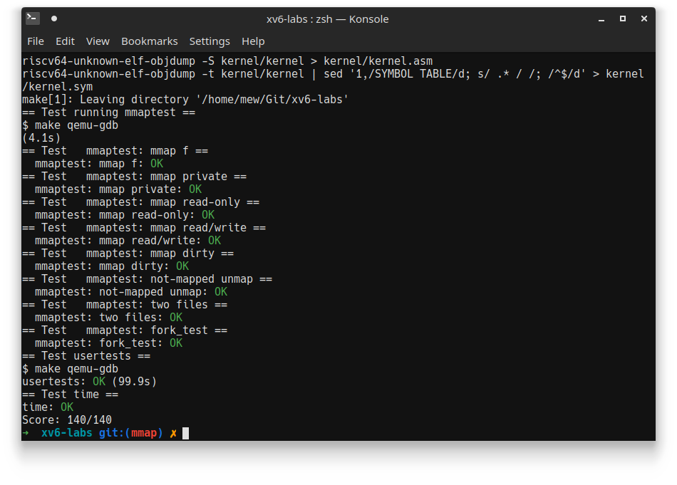

# Lab 5: Copy-on-Write 实习报告

> **姓名**：枚辉煌
>
> **学号**：1800094810
>
> **日期**：2021/04/15
- [Lab 5: Copy-on-Write 实习报告](#lab-5-copy-on-write-实习报告)
  - [1. 实验总结](#1-实验总结)
    - [Exercise 1: Implement copy-on-write](#exercise-1-implement-copy-on-write)
  - [2. 遇到的困难以及收获](#2-遇到的困难以及收获)
  - [3. 对课程或Lab的意见和建议](#3-对课程或lab的意见和建议)
  - [4. 参考文献](#4-参考文献)
## 1. 实验总结

### Exercise 1: Implement copy-on-write

Firstly, we need a bit in each pte to know whether a page is copy-on-write. Here we use 8th bit, which is reserved by RISC-V, to mark a cow page.

```c
// kernel/riscv.h: 342
#define PTE_COW (1L << 8)
```

Because we only free a physical page when the last PTE reference goes away, we need a "reference count" mechanism to track the number of user page tables that refer to a specific physical page. We implement this by creating a fixed-length array `refcnt` in `kmem` and use physical address of each page as index in the array. Because the memory grows above`KERNBASE`, the size of `refcnt` is `(PHYSTOP - KERNBASE) / PGSIZE`.  We also implement some help functions to manipulate `refcnt` and its index.

```c
// kernel/kalloc.c
struct kmem_t {
  struct spinlock lock;
  struct run *freelist;
  int refcnt[(PHYSTOP - KERNBASE) / PGSIZE];
} kmem;
...
// index of pa in refcnt
inline int
ref_idx(uint64 pa)
{
  return (pa - KERNBASE) / PGSIZE;
}

// change refcnt of pa by x
void
change_refcnt(uint64 pa, int x)
{
  int idx = ref_idx(pa);
  acquire(&kmem.lock);
  kmem.refcnt[idx] += x;
  if (kmem.refcnt[idx] < 0)
    panic("change_refcnt");
  release(&kmem.lock);
} 
```

When allocating a new page, its reference count should be initialized as 1. Besides when we free a page, we decrease its reference count by 1 and only "truly" free it when reference count becomes 0. These can be done by modifying `kalloc` and `kfree` functions

```c
// kernel/kalloc.c
void *
kalloc(void)
{
  ...
  r = kmem.freelist;
  if(r)
  {
    kmem.freelist = r->next;
    int idx = ref_idx((uint64)r);
    if (kmem.refcnt[idx] != 0)
      panic("kalloc: refcount != 0");
    kmem.refcnt[idx] = 1;
  }
  ...
}

void
kfree(void *pa)
{
  ...
  int idx = ref_idx((uint64)pa);
  acquire(&kmem.lock);
  if (kmem.refcnt[idx] == 0)
  {
    panic("kfree: refcnt == 0");
  }

  if (--kmem.refcnt[idx] > 0)
  {
    release(&kmem.lock);
    return;
  }
  // add page pa to freelist
  ...
}
```

But there is a case in which a page is freed before allocating: when xv6 boots and initializes `kmem.freelist`, it calls `freerange` to add all physical pages to `freelist`, and `freerange` calls `kfree` to do that. Because `refcnt` are all 0, so after `kfree` they will become -1, which is not correct. So we have to do some small modification here

```c
// kernel/kalloc.c
void
freerange(void *pa_start, void *pa_end)
{
  char *p;
  p = (char*)PGROUNDUP((uint64)pa_start);
  for(; p + PGSIZE <= (char*)pa_end; p += PGSIZE)
  {
    kmem.refcnt[ref_idx((uint64)p)] = 1;
    kfree(p);
  }
}
```

xv6 should normally boot now and we are ready to implement cow feature. We modify `uvmcopy` which copy parent process's page table to its child when doing `fork`. Instead of allocating new pages, we only map child process's pages to the same physical pages as parent process, clear write permission and mark them as copy-on-write pages.

```c
// kernel/vm.c:325
int
uvmcopy(pagetable_t old, pagetable_t new, uint64 sz)
{
  ...
  for(i = 0; i < sz; i += PGSIZE){
    ...
    pa = PTE2PA(*pte);
    // clear write permission and turn on COW bit
    flags = (PTE_FLAGS(*pte) & (~PTE_W)) | PTE_COW;

    *pte = PA2PTE(pa) | flags;
    // increase physical page's reference count by 1
    change_refcnt((uint64)pa, 1);
    // map child process's page to same physical page as parent process
    if(mappages(new, i, PGSIZE, (uint64)pa, flags) != 0){
      goto err;
    }
  }
  return 0;

 err:
  uvmunmap(new, 0, i / PGSIZE, 1);
  return -1;
}
```

Now if parent or child process try to write their data, it will cause a write page fault. We handle this just like lazy allocation in `usertrap`

```c
// kernel/trap.c
void
usertrap(void)
{
  ...
  } else if (r_scause() == 15) {
    // write page fault
    uint64 va = r_stval();
    if (copyonwrite(va) != 0)
      p->killed = -1;
  }
  ...
}
```

`copyonwrite` calls `walk` to check `va`'s pte permission, if it's a cow page, it calls `kalloc` to allocate new physical page, copy cow page data to this new page, remap in page table then calls `kfree` to decrease cow page reference count and free it if necessary. 

```c
int
copyonwrite(uint64 va)
{
  if (va >= MAXVA)
    return -1;

  struct proc *p = myproc();
  va = PGROUNDDOWN(va);
  pte_t *pte = walk(p->pagetable, va, 0);
  if (!(*pte & PTE_COW))
  {
    printf("copyonwrite: not cow page, va=%p, pte=%p\n", va, *pte);
    return -1;
  }
  uint64 pa = PTE2PA(*pte);
  uint flags = (PTE_FLAGS(*pte) & (~PTE_COW)) | PTE_W;

  void* mem = kalloc();
  if (mem == 0)
  {
    //printf("copyonwrite: out of memory\n");
    return -1;
  }

  memmove(mem, (void*)pa, PGSIZE);
  if (mappages(p->pagetable, va, PGSIZE, (uint64)mem, flags) != 0)
  {
    kfree(mem);
    return -1;
  }
  kfree((void*)pa);
  return 0;
}
```

Til this point, `cowtest` should all pass but some `usertests` will fail, because like lazy allocation, some page faults may not be handle in `usertrap` but in `copyout` when users make a read and kernel copies data from kernel space to user space. We modify `copyout` to let it handle this case if it tries to copy data to valid cow page.

```c
// kernel/vm.c:369
int
copyout(pagetable_t pagetable, uint64 dstva, char *src, uint64 len)
{
  ...
  while(len > 0){
    va0 = PGROUNDDOWN(dstva);
    if (va0 >= MAXVA)
      return -1;
    pte_t* pte = walk(pagetable, va0, 0);
    if (pte == 0)
      return -1;
    if (PTE_FLAGS(*pte) & PTE_COW)
    {
      if (copyonwrite(va0) != 0)
        return -1;
    }
    ...
  }
  return 0;
}
```

Now all `cowtest` and `usertests` should pass.



## 2. 遇到的困难以及收获

- Copy-on-Write idea is straightforward but implementation detail is complicated.
- I spent most of the time on debugging page table and it is really hard.
- I finish pagetable lab before this lab, there is `vmprint` function in pagetable lab which helps me debugging the page table. So I think it would be easier if we do pagetable lab before this lab.
- When implementing reference count, I forgot about the lock which cause `kfree` behavior incorrect.
- Reference count in `freerange` is tricky and took me a while to realize it.
- In `copyonwrite` function, I forgot to round down virtual address to its page boundary, so the pagetable is incorrect. This one line took me half day to find out and fix it!

## 3. 对课程或Lab的意见和建议

- Should change lab order to complete pagetable lab before cow lab.

## 4. 参考文献

- [cow hints on MIT website](https://pdos.csail.mit.edu/6.828/2020/labs/cow.html)

  