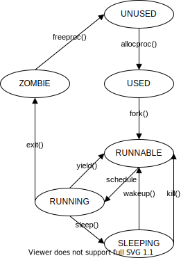
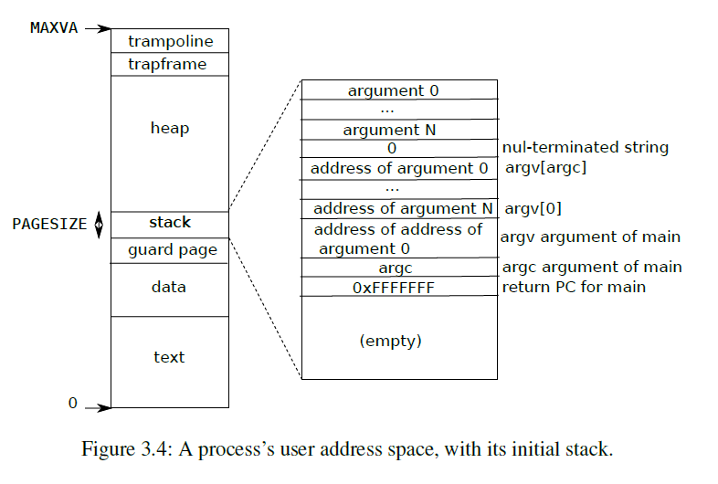

# xv6 Process

- [xv6 Process](#xv6-process)
  - [1. Process data structure](#1-process-data-structure)
  - [2. Process states](#2-process-states)
  - [3. Process address space](#3-process-address-space)
  - [4. Process creation](#4-process-creation)
  - [5. Scheduling](#5-scheduling)

## 1. Process data structure

A process is an instance of a program, i.e a running program. In xv6, a process is 
described using a data structure `struct proc` in `kernel/proc.h`
```c
// Per-process state
struct proc {
  struct spinlock lock;

  // p->lock must be held when using these:
  enum procstate state;        // Process state
  void *chan;                  // If non-zero, sleeping on chan
  int killed;                  // If non-zero, have been killed
  int xstate;                  // Exit status to be returned to parent's wait
  int pid;                     // Process ID

  // proc_tree_lock must be held when using this:
  struct proc *parent;         // Parent process

  // these are private to the process, so p->lock need not be held.
  uint64 kstack;               // Virtual address of kernel stack
  uint64 sz;                   // Size of process memory (bytes)
  pagetable_t pagetable;       // User page table
  struct trapframe *trapframe; // data page for trampoline.S
  struct context context;      // swtch() here to run process
  struct file *ofile[NOFILE];  // Open files
  struct inode *cwd;           // Current directory
  char name[16];               // Process name (debugging)
};
```
Each process consists of user-space memory (instructions, data and user stack) and per-process state private to kernel (state, channel, context, kernel stack, trapframe, ...).

Compare to Linux, xv6 process structure only holds important data which are necessary for xv6 to work:
- A spinlock `lock` to protect process data in concurrency
- Process basic information: `pid`, `parent`, `name`
- Execution state of process: `state`, `chan`, `killed`, `xstate`, `ofile`, `cwd`
- Virtual memory management: `sz`, `pagetable`
- Trap handling: `trapframe`, `kstack` 
- Context switching: `context`

When booting, xv6 creates a `init` process which is the root of process tree. xv6 uses a fixed-length array `struct proc proc[NPROC]` as process table. `NPROC` is maximum number of processes, which is defined as 64 in `kernel/param.h`.

## 2. Process states

xv6 process has 6 states:
```c
enum procstate { UNUSED, USED, SLEEPING, RUNNABLE, RUNNING, ZOMBIE }
```

Transition between process states:



- When xv6 is booting, it creates a process table and set all processes' state as `UNUSED`
- When users call `fork()` to create new process, `fork()` calls `allocproc()` to 
find an `UNUSED` process in process table 
[[kernel/proc.c:280](https://github.com/mit-pdos/xv6-riscv/blob/riscv/kernel/proc.c#L280)]. 
If there is one, `allocproc()` set its state as `USED`
[[kernel/proc.c:121](https://github.com/mit-pdos/xv6-riscv/blob/riscv/kernel/proc.c#L121)]
- After `fork()` finishes setting up new process, such as allocating trapframe and 
copying memory, it change process's state from `USED` to `RUNNABLE` 
[[kernel/proc.c:315](https://github.com/mit-pdos/xv6-riscv/blob/riscv/kernel/proc.c#L315)]. New process is now ready to schedule
- If scheduler chooses a process to run, it changes process's state from `RUNNABLE` to `RUNNING` 
[[kernel/proc.c:454](https://github.com/mit-pdos/xv6-riscv/blob/riscv/kernel/proc.c#L454)]
- When a process is executing, there are three cases may happen:
  - It calls `sleep()` or `wait` to wait for a child process to finish executing, so process's state changes from `RUNNING` to `SLEEPING` 
  [[kernel/proc.c:545](https://github.com/mit-pdos/xv6-riscv/blob/riscv/kernel/proc.c#L545)] 
  [[kernel/proc.c:426](https://github.com/mit-pdos/xv6-riscv/blob/riscv/kernel/proc.c#L426)]. 
  - It is trapped by timer interrupt, so it calls `yield()` to give up CPU and changes states to `RUNNABLE`
  [[kernel/proc.c:500](https://github.com/mit-pdos/xv6-riscv/blob/riscv/kernel/proc.c#L500)]. 
  - It finishes execution and calls `exit()`, which changes its state to `ZOMBIE`. 
  [[kernel/proc.c:372](https://github.com/mit-pdos/xv6-riscv/blob/riscv/kernel/proc.c#L372)]. 
- When a process is sleeping, it may be waked up or killed by another process. In both cases, process's state is set to `RUNNABLE`
  [[kernel/proc.c:568](https://github.com/mit-pdos/xv6-riscv/blob/riscv/kernel/proc.c#L568)] 
  [[kernel/proc.c:589](https://github.com/mit-pdos/xv6-riscv/blob/riscv/kernel/proc.c#L589)]. 
- Zombie process will be "reaped" by its parent process or `init` process by calling `freeproc()` function, which changes its state back to `UNUSED`.
  [[kernel/proc.c:166](https://github.com/mit-pdos/xv6-riscv/blob/riscv/kernel/proc.c#L166)]. 

## 3. Process address space

Each process has its own page table to translate virtual address to physical address.
Physical address of root page table is saved in `pagetable` field in `struct proc`. Process virtual address space is continous, ranges from 0 to `MAXVA`. 
Figure 3.4 in Chapter 3 of xv6 book shows the layout of user user memory of an executing process:



In the bottom are program's text and data. The stack is a single page, its initial 
contents are created by `exec` system call. There is a guard page under stack to avoid 
stack overflowing. Above stack is heap space, which users can dynamically allocate by calling `sbrk()`. On the top are `trapframe` which saves machine state and a `trampoline` page to transit between user space and kernel space when handling traps.

## 4. Process creation

In boot time, `main.c` calls `procinit` 
[[kernel/proc.c:46](https://github.com/mit-pdos/xv6-riscv/blob/riscv/kernel/proc.c#L46)] to initialize process 
page table. `procinit()` initializes global locks `pid_lock` and `wait_lock`. Then 
it iterates through proc table, initialize each process's lock and allocate its kernel stack.

After that, `main.c` calls `userinit` 
[[kernel/proc.c:226](https://github.com/mit-pdos/xv6-riscv/blob/riscv/kernel/proc.c#L226)] to set up first user process.
`init` process is the root of process table and will reap any `ZOMBIE` processes abandoned by parent process. `userinit` sets up page table, program counter and 
stack pointer to make it starts executing `exec("/init")`.

`init.c` simply creates a shell process and wait for any processes to finish. If the 
shell exits, `init` restarts it. If a parentless process exits, `init` will reap it.
[[kernel/init.c](https://github.com/mit-pdos/xv6-riscv/blob/riscv/kernel/init.c)]

User's program calls `fork()` system call to create new child process, which is a exact copy of parent process. `fork()` is implemented in 
[[kernel/proc.c:270-319](https://github.com/mit-pdos/xv6-riscv/blob/riscv/kernel/proc.c#L270)]
 and it's quite straight-forward.

- `fork()` firstly calls `allocproc()` to find an unused process in process table. 
- `allocproc()` scans through process table `proc`. If found, it allocates new `pid`
for that process, set its state to `USED`, allocates physical memory for `trapframe`, creates new pagetable which only maps trampoline page and set up context to let process 
start executing at `forkret`. If there is no available process or any of above actions 
fails, `allocproc()` calls `freeproc()` to release it and return 0.
- If `allocproc()` success, `fork()` will copy all memory from parent process to child process, page by page. It then copies executing state of parent process, such as registers saved in trapframe, opened file descriptors, current working directory. If any actions fails, `fork()` also calls `freeproc()` and release process's lock.
- After sucessfully setting up, `fork()` sets child process's parent and its state to 
`RUNNABLE`. Now it is ready to be scheduled, in the next execution it will start executing at `forkret()` and return to user space.

## 5. Scheduling

After initializing all neccessary stuffs such as process tables, virtual memory, trap handlers,... kernel runs scheduler on each CPU by calling `scheduler()` [[kernel/main.c:44](https://github.com/mit-pdos/xv6-riscv/blob/riscv/kernel/main.c#L44)].

The scheduler runs in a form of a special process per CPU, each running `scheduler()` function
[[kernel/proc.c:438](https://github.com/mit-pdos/xv6-riscv/blob/riscv/kernel/proc.c#L438)]. It loops forever, in each loop the following things happen:
- Scan through process table and choose a `RUNNABLE` process to run
- Mark chosen process state to `RUNNING` and sets CPU's current process to it.
- Call `swtch` to switch context from scheduler to chosen process.
- Chosen process runs until it is interrupted by timer interrupt. `usertrap()` calls `yield()` to give up the CPU to scheduler [[kernel/trap.c:81](https://github.com/mit-pdos/xv6-riscv/blob/riscv/kernel/trap.c#L81)].
- `yield()` holds process's lock, changes its state back to `RUNNABLE` and calls `sched()` to switch to scheduler [[kernel/proc.c:496](https://github.com/mit-pdos/xv6-riscv/blob/riscv/kernel/proc.c#L496)].
- `sched()` makes sure that process's lock is held and interrupt is disable, check process's state then calls `swtch` to switch back to scheduler [[kernel/proc.c:475](https://github.com/mit-pdos/xv6-riscv/blob/riscv/kernel/proc.c#L475)]
- Till this point, CPU should return to scheduler at [[kernel/proc.c:460](https://github.com/mit-pdos/xv6-riscv/blob/riscv/kernel/proc.c#L460)]. Scheduler releases process's lock and repeats the cycle.

Context switching function `swtch` is implemented in `swtch.S` [[kernel/switch.S](https://github.com/mit-pdos/xv6-riscv/blob/riscv/kernel/swtch.S)]. It takes two arguments: `struct context* old` and `struct context* new`, saves callee-registers in `old` and load registers in `new`, then returns. `swtch` does not save `pc` but saves `ra`, `sp` and callee-registers because caller-registers are saved by calling C function. 

Some points worth noticing about the scheduler:
- It is obvious that xv6 scheduling algorithm is Round-Robin
- scheduler's context is saved in `cpu->context`, it calls `swtch(&c->context, &p->context)` to switch to chosen process [[kernel/proc.c:456](https://github.com/mit-pdos/xv6-riscv/blob/riscv/kernel/proc.c#L456)] and `swtch(&p->context, &mycpu()->context)` to switch back [[kernel/proc.c:490](https://github.com/mit-pdos/xv6-riscv/blob/riscv/kernel/proc.c#L490)].
- When switching from scheduler to user process, scheduler first holds process's lock [[kernel/proc.c:449](https://github.com/mit-pdos/xv6-riscv/blob/riscv/kernel/proc.c#L449)] then the lock is released by switched-to code [[kernel/proc.c:502](https://github.com/mit-pdos/xv6-riscv/blob/riscv/kernel/proc.c#L502)]. The same rule is applied when switching from user process to scheduler [[kernel/proc.c:499](https://github.com/mit-pdos/xv6-riscv/blob/riscv/kernel/proc.c#L499)] 
[[kernel/proc.c:462](https://github.com/mit-pdos/xv6-riscv/blob/riscv/kernel/proc.c#L462)]. These rules is to avoid scheduler on two different CPU choosing the same process.