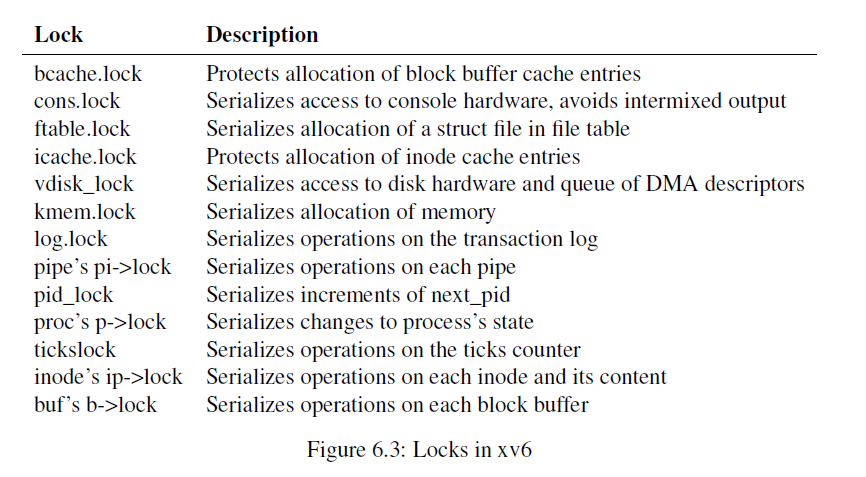

# xv6 Locks

- [xv6 Locks](#xv6-locks)
  - [1. Introduction](#1-introduction)
  - [2. spinlock](#2-spinlock)
  - [3. sleeplock](#3-sleeplock)

## 1. Introduction

xv6 runs on a multiprocessor hardware which is virtualized by QEMU, so processes can independently run on different CPUs but they shares the same physical memory. Even on a uniprocessor hardware, xv6 also can schedule multiple processes on a single CPU, switch them back and forth. Besides, interrupt handlers also cause process's execution to be interleaved. In all three cases, a process may be in the middle of executing some shared data modifications, and interleaving them without synchronization can causes programs to be incorrect.

For example, xv6's physical memory allocator shares a linked list `freelist` which manages physical memory pages among CPUs in `struct kmem` . xv6 uses a spinlock `lock` in `struct kmem` to control concurrency of reading and writing `freelist`.

```c
// kernel/kalloc.c:21
struct {
  struct spinlock lock;
  struct run *freelist;
} kmem;
```

`kalloc.c` haves two functions `kalloc()` [[kernel/kalloc.c:68](https://github.com/mit-pdos/xv6-riscv/blob/riscv/kernel/kalloc.c#L68)] and `kfree()`  [[kernel/kalloc.c:47](https://github.com/mit-pdos/xv6-riscv/blob/riscv/kernel/kalloc.c#L47)] to allocate and free a physical memory page.  Their implementations are quite straightforward:

- `kalloc` takes the first page in `freelist` as `r`, set `r->next` as the head of `freelist` and return `r` as new allocated physical page. 

- `kfree` does some checks on physical page then append it at the beginning of `freelist`

In both functions, they have to acquire the lock `kmem.lock` before reading and modifying `freelist` [[kernel/kalloc.c:73](https://github.com/mit-pdos/xv6-riscv/blob/riscv/kernel/kalloc.c#L73)] [[kernel/kalloc.c:59](https://github.com/mit-pdos/xv6-riscv/blob/riscv/kernel/kalloc.c#L59)] and release the lock when they are done with it [[kernel/kalloc.c:77](https://github.com/mit-pdos/xv6-riscv/blob/riscv/kernel/kalloc.c#L77)] [[kernel/kalloc.c:62](https://github.com/mit-pdos/xv6-riscv/blob/riscv/kernel/kalloc.c#L72)]. Without the lock, the following things may happen:

- Two processes call `kalloc()` get the same physical page at the beginning of `freelist`. In this case a process can overwrite data of another process.

- Two processes call `kfree()` at the same time to free two different pages, let's call `r1` and `r2`, and see the same `kmem.freelist`. Below sequence of executing instructions may happen:

  ```c
  // process 1
  r1->next = kmem.freelist;
  // switch to process 2
  r2->next = kmem.freelist;
  kmem.freelist = r2;
  // switch to process 1
  kmem.freelist = r1;
  ```

  It's easy to see that there is no pointer to `r2` so we missed a physical page and cause memory leak.

- One process call `kalloc()`, another process call `kfree()` and execution order is:

  ```c
  // process 1 calls kalloc()
  r1 = kmem.freelist;
  // switch to process 2, which calls `kfree()`
  r2->next = kmem.freelist;
  kmem.freelist = r2;
  // switch back to process 1
  kmem.freelist = r1->next;
  ```

  Again we missed page `r2` and cause another memory leak.

And there are many serious bugs may happen if we don't use any concurrency control techniques. xv6 uses two type of locks to synchronize concurrency: **spinlock** and **sleeplock**. Figure 6.3 in xv6 books lists all locks used in xv6



## 2. spinlock

`spinlock` data structure is defined in `kernel/spinlock.h`

```c
// Mutual exclusion lock.
struct spinlock {
  uint locked;       // Is the lock held?

  // For debugging:
  char *name;        // Name of lock.
  struct cpu *cpu;   // The cpu holding the lock.
};
```

It uses a `uint locked` to mark whether the lock is locked, `name` and `cpu` are just handful for debugging. Use `spinlock` is simple, firstly we call `initlock` to initialize the lock, which simply set `locked` to 0

```c
// kernel/spinlock.c:11
void
initlock(struct spinlock *lk, char *name)
{
  lk->name = name;
  lk->locked = 0;
  lk->cpu = 0;
}
```

Use spinlock to protect shared data:

```c
acquire(&lock);
// critical section
release(&lock);
```

We expand the implementation of `acquire()` and `release()`:

```c
// acquire(&lock);
push_off();
if (holding(lock))
    panic("acquire");

while (__sync_lock_test_and_set(&lock->locked, 1) != 0)
    ;

__sync_synchronize();
lock->cpu = mycpu();

// critical section

// release(&lock);
if (!holding(lock))
    panic("release");

lock->cpu = 0;
__sync_synchronize();
__sync_lock_release(&lock->locked);
pop_off();
```

Firstly, we discuss about `push_off()` and `pop_off()`. They are like `intr_off()` and `intr_on()` which turn off and on interrupts except they are matched: it takes two `pop_off()`s to undo two `push_off()`s. The reason to introduce `push_off()` and `pop_off()` is to avoid deadlock. Some spinlocks may protect data that is used by both processes and interrupt handlers, if process is holding the lock that interrupts handlers want to acquire, it will cause a deadlock because only the holding-lock process can release it, but it can't continue execution until interrupt handler returns.

Secondly, `acquire()` uses GCC atomic built-in function `__sync_lock_test_and_set` to set `&lock->locked` to 1. This function then turns into an atomic swap instruction `amoswap`, which write 1 into `lock->locked` and return previous content of `lock->locked`, which is 0. So `acquired()` will be busy waiting (spinning) until the lock is released, which wastes CPU cycle.

Thirdly, `release()` calls another atomic built-in function `__sync_lock_release()`, normally this means writing the constant 0 to `lock->locked`.

Finally, we see that both `acquire` and `release` call `__sync_synchronize()`. This function issues a full memory barrier, which tells the compiler not to perform instruction re-ordering past this two points to ensure data references in critical section happen strictly between `acquire` and `release`. In other words, "what happen in critical section, stay in critical section".

## 3. sleeplock

Sometimes a process may hold a lock for a long time, for example to keep a file locked while reading and writing its content on the disk. If another process tries to acquire the lock, it will waste CPU cycle for a long time too because it can't yield the CPU for other processes while busy waiting (looping) on the lock. Besides, `acquire()` disables interrupts so timer interrupts can't interleave the process to switch to other processes. Therefore, we would like a type of lock that yields the CPU while waiting to acquire and allow interrupts while the lock is held.

`sleeplock` data structure is defined in `kernel/sleeplock.h`

```c
// Long-term locks for processes
struct sleeplock {
  uint locked;       // Is the lock held?
  struct spinlock lk; // spinlock protecting this sleep lock
  
  // For debugging:
  char *name;        // Name of lock.
  int pid;           // Process holding lock
};
```

sleeplock uses a spinlock `lk` to protect `locked` field, which is share among processes. To acquire and release sleeplock, we call two functions `acquiresleep()` and `releasesleep()`

```c
// kernel/sleeplock.c:21
void
acquiresleep(struct sleeplock *lk)
{
  acquire(&lk->lk);
  while (lk->locked) {
    sleep(lk, &lk->lk);
  }
  lk->locked = 1;
  lk->pid = myproc()->pid;
  release(&lk->lk);
}

void
releasesleep(struct sleeplock *lk)
{
  acquire(&lk->lk);
  lk->locked = 0;
  lk->pid = 0;
  wakeup(lk);
  release(&lk->lk);
}
```

In `acquiresleep()`, because it's trying to read `locked` field so it has to acquire the spinlock `lk` first. If the sleeplock is held by other process, it calls `sleep` [[kernel/proc.c:529](https://github.com/mit-pdos/xv6-riscv/blob/riscv/kernel/proc.c#L529)] which release the spinlock and put itself to `SLEEPING` state. Before changing process's state to `SLEEPING` and yielding CPU, it sets process's channel `p->chan` to the spinlock, so that it can be waked up if other process releases the sleeplock. After waking up, it clears sleeping channel and try to acquire the sleeplock again.

`releasesleep()` simply sets `locked` field to 0 and calls `wakeup()` [[kernel/proc.c:560](https://github.com/mit-pdos/xv6-riscv/blob/riscv/kernel/proc.c#L560)] to make all other processes waiting on the lock to be schedulable. `wakeup()` scans through process table, checks if a process is sleeping on the lock channel and changes its state back to `RUNNABLE` so it can be scheduled later. 

sleeplocks are used in file system to protect the file data structure `inode` [[kernel/file.h:21](https://github.com/mit-pdos/xv6-riscv/blob/riscv/kernel/file.h#L21)] and read/write buffer [[kernel/buf.h:6](https://github.com/mit-pdos/xv6-riscv/blob/riscv/kernel/buf.h#L6)], which requires holding the lock for a long time.

