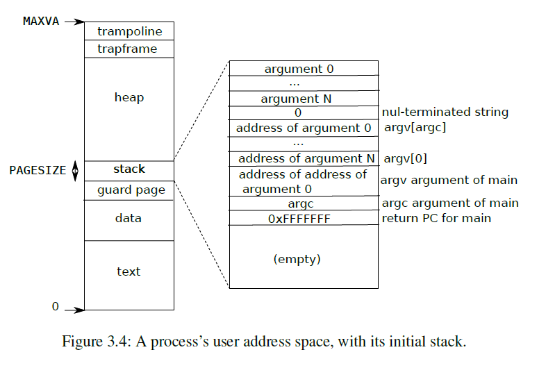

# xv6 Virtual Memory

- [xv6 Virtual Memory](#xv6-virtual-memory)
  - [1. xv6 Physical Memory Management](#1-xv6-physical-memory-management)
  - [2. Kernel Address Space](#2-kernel-address-space)
  - [3. Process Address Space](#3-process-address-space)
  - [4. RISC-V Address Translation](#4-risc-v-address-translation)
  - [5. xv6 Virtual Memory Management](#5-xv6-virtual-memory-management)

## 1. xv6 Physical Memory Management

Xv6 physical memory management is implemented in `kernel/kalloc.c`. It uses a struct `kmem` to manage all physical memory pages:

```c
// kernel/kalloc.c:21
struct {
  struct spinlock lock;
  struct run *freelist;
} kmem;
```

`kmem` has a pointer `freelist` point to the head of a singly linked list which contains all physical

memory pages and a spinlock `lock` to protect `freelist` in concurrency. When booting, xv6 calls `kinit()` [[kernel/main.c:19](https://github.com/mit-pdos/xv6-riscv/blob/riscv/kernel/main.c#L19)] to initialize `kmem`, in which it simply initializes the lock and call`freerange` to insert all available physical pages into`freelist` [[kernel/kalloc.c:33](https://github.com/mit-pdos/xv6-riscv/blob/riscv/kernel/kalloc.c#L33)].

xv6's page size is 4096 bytes, which is defined in `riscv.h` [[kernel/riscv.h:323](https://github.com/mit-pdos/xv6-riscv/blob/riscv/kernel/riscv.h#L323)]. Available physical memory is from `end`, which is provided by `kernel.ld` [[kernel/kernel.ld:43](https://github.com/mit-pdos/xv6-riscv/blob/riscv/kernel/kernel.ld#L43)], to `PHYSTOP` [[kernel/memlayout.h:48](https://github.com/mit-pdos/xv6-riscv/blob/riscv/kernel/memlayout.h#L48)].

Two important functions in `kalloc.c` are `kalloc`and `kfree`, which allocate and free a physical page. Both functions are straight-forward:

- `kalloc` acquires the lock, remove the first physical page in `freelist`, release the lock and return the pointer. If there is no available page, `kalloc` return 0 [[kernel/kalloc:69](https://github.com/mit-pdos/xv6-riscv/blob/riscv/kernel/kalloc.c#L69)]

- `kfree` takes physical address of the page, check if the address is aligned and in the valid address range. If it passes the test, `kfree` acquires the lock, insert the new page to the head of `freelist` and release the lock. [[kernel/kalloc.c:46](https://github.com/mit-pdos/xv6-riscv/blob/riscv/kernel/kalloc.c#L46)].

## 2. Kernel Address Space

After initializing physical page allocator, xv6 calls `kinit()` to set up kernel page table [[kernel/main.c:20](https://github.com/mit-pdos/xv6-riscv/blob/riscv/kernel/main.c#L20)]. `kinit()` calls `kvmmake()` to create kernel virtual memory and assign the return address to global variable `kernel_pagetable` [[kernel/vm.c:56](https://github.com/mit-pdos/xv6-riscv/blob/riscv/kernel/vm.c#L56)]. 

`kvmmake()`firstly allocate a physical page to hold the root pagetable page, then it calls `kvmmap` to install all the translations that the kernel needs, including kernel's instructions and data, kernel stacks, I/O devices,... Kernel memory layout is described by Figure 3.3 in xv6 book:


We see that kernel uses directed-mapped address (virtual address = physical address) for` CLINT`, `PLIC`, `UART`, `VIRTIO disk` and kernel text, data,... Trampoline page and kernel stacks are at the top of virtual address space and mapped to free physical memory by using `kalloc`. Each process has its own kernel stack, which is mapped right below trampoline page and has a guard page to detect if kernel overflows a kernel stack. Guard pages have no permission bits, so it will causes an exception if overflowing kernel stacks.

After `kinit()`, xv6 calls `kvminithart()` to install kernel page table to hardware and turn on virtual address translation by writing `kernel\_pagetable` to `satp` register and execute`sfence.vma` instruction to flush all TLB entries [[kernel/vm.c:62](https://github.com/mit-pdos/xv6-riscv/blob/riscv/kernel/vm.c#L62)]. From this point, all addresses are automatically translated by RISC-V hardware.

## 3. Process Address Space

Each process has its own page table to translate virtual address to physical address.

Physical address of root page table is saved in `pagetable` field in `struct proc`. Process virtual address space is continuous, ranges from 0 to`MAXVA`.

Figure 3.4 in Chapter 3 of xv6 book shows the layout of user user memory of an executing process:



In the bottom are program's text and data. The stack is a single page, its initial contents are created by `exec` system call. There is a guard page under stack to avoid stack overflowing. Above stack is heap space, which users can dynamically allocate by calling`sbrk()`. On the top are `trapframe` which saves machine state and a `trampoline` page to transit between user space and kernel space when handling traps.

## 4. RISC-V Address Translation

Figure 3.2 in xv6 book shows virtual address translation in details:


xv6 runs on Sv39 RISC-V, so it only uses bottom 39 bits of 64-bit virtual address and the top 25 bits are not used. Bottom 39 bits contains two parts:

- Top 27 bits: index in page table to find physical page, divided into 3 sub-indexes: L2, L1, L0, each sub-index contains 9 bits.

- Bottom 12 bits: offset in physical page. Therefore, each page is a chunk of 2<sup>12</sup> = 4096 bytes.

A page table is stored in physical memory as a three-level tree. Each tree is a page directory containing 2<sup>9</sup> = 512 page table entries (PTEs). Each PTE contains a 44-bit physical page number (PPN) and 10-bit flags of permissions:

- `PTE_V` indicates whether PTE is present

- `PTE_R` controls whether instructions are allowed to read the page.

- `PTE_W` controls whether instructions are allowed to write the page.

- `PTE_X` controls whether CPU can interpret the content of the page as instructions and execute them.

- `PTE_U` controls whether instructions in user mode are allowed to access this page. If it is not set, only kernel can access this page.

- `PTE_G` implies that all mappings in the next levels of the page table are global.

- `PTE_A` indicates whether PTE is accessed (read/write/execute)

- `PTE_D` indicates whether PTE is written. PTE\_A and PTE\_D may be helpful in caching.

- The last two bits are reserved for supervisor software and kernel can use them freely, for example to mark a page is copy-on-write.

RISC-V address translation process:

- Read the physical address of the root page table in `satp` register.

- Find PTE at index L2, get PPN and flags. Check flags to make sure permissions are valid, use PPN as physical address for next level page table.

- Repeat above step until we get level 0 PTE.

- Physical address = 44-bit PPN in level 0 page table + 12-bit offset in virtual address.

When translating address, if any of the three PTEs required to translate an address is not present, RISC-V will raises a *page-fault exception* so that kernel can catch and handle the exception.

To tell the hardware to use a page table, xv6 writes physical address of process's root page table into `satp` register. Each CPU has its own `satp`, which allows different CPUs to run different processes simultaneously.

## 5. xv6 Virtual Memory Management

xv6 manages virtual memory by implementing a handful number of helper functions and macros

in `kernel/vm.c` [[kernel/vm.c](https://github.com/mit-pdos/xv6-riscv/blob/riscv/kernel/vm.c)] and `kernel/riscv.h` [[kernel/riscv.h](https://github.com/mit-pdos/xv6-riscv/blob/riscv/kernel/riscv.h)]:

- `PGROUNDUP` and `PGROUNDDOWN` round an address to the boundary of its page table.

- `PA2PTE(pa)` convert physical address to corresponding PTE by clearing bottom 12 bits for PPN and shift left 10 bits for flags.

- `PTE2PA(pte)` reverses above operation and get PPN in PTE, page aligned.

- `PTE\_FLAGS(pte)` gets bottom 10-bit flags of a PTE.

- `PX(level, va)` gets 9-bit page table index of corresponding `level` in virtual address `va`.

- `walk` mimics the address translation process of RISC-V and return the physical address of the last level PTE corresponding to a virtual address `va`. In translation process if there is any PTE is not present and `alloc` parameter is set, it will allocate new PTE accordingly. 
- `walkaddr` translates a virtual address to physical address, it calls `walk` to get the corresponding PTE, check the permissions and use `PTE2PA` to get physical address. Note that `va` should be page aligned, because `walkaddr` does not add `va`'s offset to return address `pa`.

- `mappages` maps a virtual address range [`va`, `va+size`) to physical address range [`pa`,`pa+size`). It simply calls `walk` function with `alloc=1` to create new PTE and write its content with corresponding `pa` and `perm`.

- `uvmunmap` reverses `mappages` action, it removes `npages` of mappings from `va` and free physical memory if `do_free` is set. It calls `walk` to find the PTE, check flags and clear its content.

- `kvmmap` makes use of `mappages` to add a mapping to kernel page table, used when initializing kernel page table.

- `uvmcreate` create new user page table, simply allocate a new physical page and initializes all contents with 0.
- `uvmalloc` allocate PTEs and physical memory to grow process from `oldsz` to `newsz`. It allocates a new page and calls `mappages` function to create new mappings. If there is any errors, for example no free physical memory available or `mappages` failed, it will automatically reverses all actions including free allocated page and `uvmdealloc` to un-map previous mappings.

- `uvmdealloc` reverses `uvmalloc` operations by calculating the number of pages need to deallocated and calls `uvmunmap` to do the actions.

- `freewalk` recursively free all pages in user page-table, but all leaf mappings must already have been removed. `freewalk` iterates 512 PTEs in page table, recursively free next level page table, and calls `kfree` to release physical memory.

- `uvmfree` free all user memory pages, including physical pages, it can be used when a process is destroyed. `uvmfree` firstly calls `uvmunmap` with `do_free=1` to remove all leaf mappings and their corresponding physical pages, then calls `freewalk` to free process's page table.

- `uvmcopy` is used to copy parent process's page table to child's page table, including all mappings and contents in physical memory. Note that `uvmcopy` is deep-copying, which means virtual addresses in parent and child process with same value will point to different physical pages, but their contents will be identical, writing new content to physical pages in one process does not affect content in another's. `uvmcopy` is implemented by iterating through parent's page table and allocate new physical page for each mapping in child's page table.

- `uvmclear` mark a PTE invalid for user access by calling `walk` to find PTE and clearing its `PTE_U` bit.

- `copyin`, `copyout` and `copyinstr` are used to manipulating data between kernel and user process. Because kernel and user processes have their own page table, so when user process pass an address to a system call (read, write,...), kernel need to translate it to physical address that it can directly reference. This can be done by passing process's page table and virtual address to `walkaddr` and use `memmove` to copy data back and forth.

