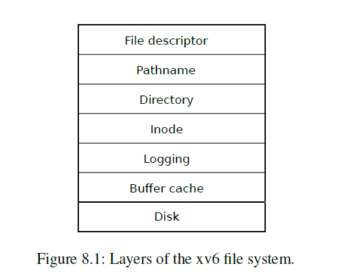
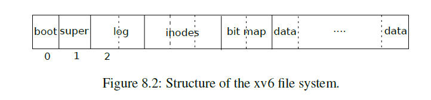

# xv6 File System


## 1. File system structure

xv6 file system provides Unix-like files, directories, pathnames and store its data on a virtio disk for persistence. Besides, it supports *crash recovery* by implementing a **logging** layer and improve disk I/O performance by maintaining a **buffer cache** layer in memory. 

xv6 file system has seven layers, shown in Figure 8.1 from xv6 book



- **Disk layer** read and writes blocks on an virtio hard drive
- **Buffer cache layer** caches the disk blocks and synchronizes access to them, make sure that only one kernel process can modify the data stored in any particular block at a time
- **Logging layer** allows higher layers to wrap updates to several blocks in a *transaction*, all or none of updates are written to disk.
- **Inode layer** provides individual files an **inode**, each inode has an unique **i-number** and a data structure to hold contents of of the file. 
- **Directory** is a special kind of inode, its content is a sequence of directory entries, each of which contains a file's name and i-number.
- **Pathname layer** provides hierarchical path names like `/root/usr/a` and resolve them with recursive look up.
- **File descriptor layer** abstracts the file with other resources such as pipes, devices,... using the file system interface. Programmers mainly use file descriptor and pathname to interact with file system.

## 2. Disk layer

xv6 file system on disk structure is shown in Figure 8.2 from xv6 book



- Block 0 holds the boot sector, xv6 does not use this block
- Block 1 is **superblock**, which contains metadata about the file system, such as the file system size in blocks, the number of data blocks, the number of inodes and the number of blocks in the log
- Blocks starting at 2 hold the **log**, which is used to implement write transaction
- After the log are the inodes, with multiple inodes per block
- After inodes are bitmap, which is used to manage free blocks.
- Finally, the remaining blocks are data blocks, which may contains data of files or free.

Contents in superblock are written by `mkfs/mkfs.c`

```c
// kernel/fs.h:12

// mkfs computes the super block and builds an initial file system. The
// super block describes the disk layout:
struct superblock {
  uint magic;        // Must be FSMAGIC
  uint size;         // Size of file system image (blocks)
  uint nblocks;      // Number of data blocks
  uint ninodes;      // Number of inodes.
  uint nlog;         // Number of log blocks
  uint logstart;     // Block number of first log block
  uint inodestart;   // Block number of first inode block
  uint bmapstart;    // Block number of first free map block
};

// mkfs/mkfs.c

  // 1 fs block = 1 disk sector
  nmeta = 2 + nlog + ninodeblocks + nbitmap;
  nblocks = FSSIZE - nmeta;

  sb.magic = FSMAGIC; // FSMAGIC = 0x10203040
  sb.size = xint(FSSIZE); // FSSIZE = 1000
  sb.nblocks = xint(nblocks);
  sb.ninodes = xint(NINODES); // NINODES = 200
  sb.nlog = xint(nlog);
  sb.logstart = xint(2);
  sb.inodestart = xint(2+nlog);
  sb.bmapstart = xint(2+nlog+ninodeblocks);
```

`mkfs.c` also create an inode for root directory and give root inode dir a fixed size [[mkfs/mkfs.c:166](https://github.com/mit-pdos/xv6-riscv/blob/riscv/mkfs/mkfs.c#L166)]

Disk driver is implemented in `kernel/virtio_disk.c`. `virtio_disk_init` initializes `struct disk`, which holds allocated memory for kernel to communicate with virtio disk via DMA. Because this is hardware-related, so we just skip this part.

The most important part in `virtio_disk.c` is `virtio_disk_rw` [[kernel/virtio_disk.c:204](https://github.com/mit-pdos/xv6-riscv/blob/riscv/kernel/virtio_disk.c#L204)], which is used to read contents from a specified block to a cache buffer, or write buffer contents to block if `write = 1`. It simply translates block number to sector number, and sets up all information disk driver needs to operate to `struct disk`, goes to sleep until `virtio_disk_intr()` wakes it up. `virtio_disk_rw` is used in buffer cache layer to read/write buffer contents. 

## 3. Buffer cache layer

The buffer cache layer has two jobs:

- To synchronize access to disk blocks to ensure that only one copy of a block is in memory and that only one kernel thread at a time uses that copy
- Cache popular blocks so that they don't need to be re-read from disk.

Buffer cache layer's implementation is `kernel/bio.c`. It firstly defines `struct buf` to hold contents of a block:

```c
// kernel/bufh.h

struct buf {
  int valid;   // has data been read from disk?
  int disk;    // does disk "own" buf?
  uint dev;
  uint blockno;
  struct sleeplock lock;
  uint refcnt;
  struct buf *prev; // LRU cache list
  struct buf *next;
  uchar data[BSIZE]; // Block size = 1024 bytes
};
```

Note that each buffer has its own sleeplock `lock`, which will be locked when waiting for I/O request to finish and waked up by `virtio_disk_intr()`.

Buffer cache is just a linked list of all buffers sorted by Least Recently Used, it also has a spinlock to protect its data.

```c
// kernel/bio.c:26

struct {
  struct spinlock lock;
  struct buf buf[NBUF]; // NBUF = MAXOPBLOCKS*3 = 30

  // Linked list of all buffers, through prev/next.
  // Sorted by how recently the buffer was used.
  // head.next is most recent, head.prev is least.
  struct buf head;
} bcache;
```

There are several functions in `bio.c`:

- `binit()` simply initializes `bcache`'s spinlock, all buffers and their sleeplock.
- `bget(uint dev, uint blockno)` look through buffer cache for block on device `dev`. If the block is in buffer cache, it increase buffer's reference count by 1 and return the buffer. If the block is not cached, it recycles the least recently used free buffer with (`refcnt = 0`). Note that after `bget` the buffer is locked and ready for I/O request. If all the buffers are busy, then too many processes are simultaneously executing file system calls, `bget` will panic. If `bget` sleeps and waits for a free buffer, it may cause deadlock.
- `bread(uint dev, uint blockno)` read contents from the block `blockno` from device `dev`. It simply call `bget` to get a locked buffer `b` and call `virtio_disk_rw(b, 0)` to read its contents from disk if the data in buffer are invalid.
- `bwrite(struct buf *b)` writes data of buffer `b` to disk at block `b->blockno`. It checks if the sleeplock is held and call `virtio_disk_rw(b, 1)` to execute the write.
- `brelse(struct buf *b)` release a locked buffer and move it to the head of the most-recently-used linked list. A kernel thread must call `brelse` to release the buffer when it is done with it.
- `bpin` and `bunpin` are used to increase or decrease reference count of a buffer.

## 4. Logging layer

xv6 uses a simple form of logging for crash recovery. An xv6 system call does not directly write to the disk, instead it does following actions:

- Placing a description of all the disk writes into **log** section on the disk.
- When all the writes are logged on the disk, write an **commit** record to let file system know that logging is completed.
- File system copies all the writes from log section to destination block.
- After those writes are completed, erase the log on disk.

So if crash happens, there are two cases may happen:

- There is no **commit** record in **log** section, kernel just wipe **log** section and continue to boot.
- **Commit** record appear in log section, so kernel will copy data from log section to their destination. If crash happens again, it may write multiple times, but once all those writes are completed, kernel wipes the log and continue to boot.

In both cases, all or none of the writes are written to disk, which satisfies *transaction* requirements.

In details, the log consists of a header block followed by a sequence of "logged blocks". The header block contains an array of sector numbers, one for each of the logged blocks, and the count of log blocks. The count in header block on disk is either zero (no transaction) or non-zero (a completed transaction). 

```c
// kernel/log.c:33

// Contents of the header block, used for both the on-disk header block
// and to keep track in memory of logged block# before commit.
struct logheader {
  int n;
  int block[LOGSIZE];
};
```

xv6 only writes the header block when a transaction commits, so a crash midway through a transaction will result in a count of zero in the log’s header block; a crash after a commit will result in a non-zero count.

The log details is defined in `struct log`

```c
// kernel/log.c:40

struct log {
  struct spinlock lock;
  int start;
  int size;
  int outstanding; // how many FS sys calls are executing.
  int committing;  // in commit(), please wait.
  int dev;
  struct logheader lh;
};
struct log log;
```

The log is initialized by `initlog()` [[kernel/log.c:55](https://github.com/mit-pdos/xv6-riscv/blob/riscv/kernel/log.c#L55)], which is called from `fsinit` during boot time, before the first user process runs. `initlog()` initializes the spinlock, writes the start sector number of the log in `log.start` and log block size in `log.size`, both are defined in superblock. It then calls `recover_from_log()` to recover crash from log.

`recover_from_log()` [[kernel/log.c:116](https://github.com/mit-pdos/xv6-riscv/blob/riscv/kernel/log.c#L116)] read the log header from disk into memory by calling `read_head()`, and then call `install_trans`to write transaction. Finally, it set the count to zero and erase transaction from the log.

A typical use of the log looks like this:

```c
begin_op();
...
bp = bread(...);
bp->data[...] = ...;
log_write(bp);
...
end_op();
```

- `begin_op()` [[kernel/log.c:126](https://github.com/mit-pdos/xv6-riscv/blob/riscv/kernel/log.c#L126)] first tries to acquire `log.lock`, then waits until **commit** is completed. It then to waits for reserved space in log, and finally increase `log.outstanding` by one and release the lock.
- `end_op()` [[kernel/log.c:126](https://github.com/mit-pdos/xv6-riscv/blob/riscv/kernel/log.c#L146)] decrease `log.outstanding` by one, if there is no more file system call, it will do commit by calling `commit()`, otherwise wake up other threads currently waiting for reserved space. 
- `commit()` [[kernel/log.c:193](https://github.com/mit-pdos/xv6-riscv/blob/riscv/kernel/log.c#L193)] calls `write_log()` to write modified blocks from cache to log, then calls `write_head()` to write log header to log section, after that `install_trans()` will copy data from log section to home locations, finally it erase the transaction by setting header number to zero and call `write_head()`.
- `write_log()` [[kernel/log.c:179](https://github.com/mit-pdos/xv6-riscv/blob/riscv/kernel/log.c#L179)] iterates through all blocks in `log.block`, for each block it call `bread()` to get two in-memory buffers: buffer `from` containing data in buffer cache and buffer `to` represents block in log section. It then copy data from `from` to `to` buffer by `memmove`, call `bwrite(to)` to write data to log section on disk, finally release both buffer by calling `brelse()`
- `write_head()` [[kernel/log.c:102](https://github.com/mit-pdos/xv6-riscv/blob/riscv/kernel/log.c#L102)] writes in-memory log header to disk. It is similar to `write_log()`, it calls `bread` to get a buffer representing log header, write in-memory log header data into this buffer and write them back to on-disk log section. After `write_head()`, transaction is fully committed.
- `install_trans()` [[kernel/log.c:68](https://github.com/mit-pdos/xv6-riscv/blob/riscv/kernel/log.c#L68)]copies committed blocks from log section to destination blocks. This is done by iterating through all logged blocks, call `bread` to get two in-memory buffers: `lbuf` (logged buffer) and `dbuf` (destination buffer), then it copies data from `lbuf` to `dbuf`, then call `bwrite(dbuf)` to officially write data to destination block. If `install_trans()` is called from `recover_from_log()`, it will `bunpin(dbuf)` to decrease its reference count.
- Besides, `log_write()` [[kernel/log.c:214](https://github.com/mit-pdos/xv6-riscv/blob/riscv/kernel/log.c#L214)] acts as a proxy of `bwrite`. It does an additional check and skip if the buffer is in the log, otherwise it will append the buffer to the log.

## 5. Block allocator

Block allocator is implemented in `kernel/fs.c`, mainly in two functions `balloc()` and `bfree()`

- `balloc()` [[kernel/fs.c:65](https://github.com/mit-pdos/xv6-riscv/blob/riscv/kernel/fs.c#L65)] iterates through bitmap section, each block in bitmap section contains `BPB = BSIZE * 8 = 8192` bits. It first call `bread` to read bitmap block into memory, then checks bit by bit to find a free block number. If found one, it mark the bit as 1 and call `log_write` to let logging layer write bitmap block back to disk. If there is no block available, `balloc` panics.
- `bfree()` [[kernel/fs.c:89](https://github.com/mit-pdos/xv6-riscv/blob/riscv/kernel/fs.c#L89)]simply reads the bitmap block that contain block number `bp`, mark the bit in buffer as 0 and call `log_write` to write back to disk.

## 6. Inode layer

An inode describes a single unnamed file. It has two representations: in-memory and on-disk inode:

```c
// kernel/fs.h:31
// On-disk inode structure
struct dinode {
  short type;           // File type
  short major;          // Major device number (T_DEVICE only)
  short minor;          // Minor device number (T_DEVICE only)
  short nlink;          // Number of links to inode in file system
  uint size;            // Size of file (bytes)
  uint addrs[NDIRECT+1];   // Data block addresses
};

// kernel/file.h:16
// in-memory copy of an inode
struct inode {
  uint dev;           // Device number
  uint inum;          // Inode number
  int ref;            // Reference count
  struct sleeplock lock; // protects everything below here
  int valid;          // inode has been read from disk?

  short type;         // copy of disk inode
  short major;
  short minor;
  short nlink;
  uint size;
  uint addrs[NDIRECT+1];
};
```

xv6 uses index table to save data block number, each inode has 12 direct addresses and one pointer to indirect index table. So in theory it maximum file size is `12 + 1024 / 4 = 268` bytes. The inodes are laid out sequentially on disk at `sb.startinode`. Each inode has a number, indicating its position on the disk.

xv6 maintains a in-memory inode table with a spinlock to protect it, there are at most 50 active inodes in memory:

```c
struct {
  struct spinlock lock;
  struct inode inode[NINODE];
} itable;
```

- `iinit()` is used to initialize the inode table spinlock and all in-memory inode's sleeplock.
- `iget(uint dev, uint inum)` find the inode with number `inum` on device `dev` and return the in-memory copy. It first check if the inode is in the inode table and return it, otherwise it finds an empty slot in table, mark `dev` and `inum`, set inode's `valid` as 0 so it will be read from disk in latter access.
- `ialloc(uint dev, short type)` allocate an inode on device `dev` with type `type`. It first read all inodes from disk by using `bread`, one block at a time, and find a free inode. If found one, it mark the type of inode as `type`, write it back to disk and load inode into memory by calling `iget()`

- `iupdate(struct inode *ip)` copy a modified in-memory inode to disk, it is done by loading disk inode into memory buffer `bp`, copy data to this buffer and write back to disk by `log_write`
- `idup(struct inode *ip)` simply increase reference count `ip` and return it.
- `ilock(struct inode *ip)` tries to lock inode `ip` and reads the inodes from disk if necessary. It check `ip->valid`, if valid is zero `ilock` begins to read on-disk inode information and copy them to `ip`, then mark `valid` as 1.
- `iunlock(struct inode *ip)` tries to unlock given inode, it first checking if `ip->lock` is held and `ip->ref` is non-zero, then call `releasesleep` to release the lock.
- `iput(struct inode *ip)` drop a reference to an in-memory inode `ip`. If that was the last reference, it will be truncate and free so inode table entry can be recycled.
- `bmap(struct inode *ip, uint bn)` reads `ip` content in `bn`th block on the disk, if there is no such block on the disk, `bmap` will allocate one. `bmap` returns the block number on disk. `bmap` checks the range of `bn` to identify `bn` in direct or indirect addresses, and call `balloc()` if the address is zero.
- `itrunc(struct inode *ip)` is used to discard contends in inode. It iterates through all direct and indirect addresses and call `bfree` to free disk block. Finally, it set inode size as 0 and write inode data back to disk.
- `readi` read `n` bytes data from inode starting at `offset` and put them in a specific address `dst`, which may be kernel or user virtual address. `readi` uses `bread` to read data of inode from disk, then call `either_copyout` to copy data from buffer to destination address.
- `writei` write `n` bytes data from inode `ip` starting at `offset`, data is from address `user_src`. `writei`  call `bread` to get a buffer, call `either_copyin` to copy data from user space to buffer, finally calls `log_write` to write back to disk.

## 6. Directory layer

A directory is implemented internally much like a file, with inode type `T_DIR` and its data is a sequence of directory entries. Each entry is a `struct dirent`, which holds inode number and its name.

```c
// kernel/fs.h:53
// Directory is a file containing a sequence of dirent structures.
#define DIRSIZ 14

struct dirent {
  ushort inum;
  char name[DIRSIZ];
};
```

- `dirlookup` searches a directory for an entry with the given name. If it finds one, it returns a pointer to the corresponding `inode`, unlocked, and sets `*poff` to the byte offset of the entry within the directory. `dirlookup` uses `readi` to read all directory entries and compare their names with given name. If the name is matched, it call `iget` to get corresponding inode into memory.
- `dirlink()` writes a new directory entry with `name` and `inum` to given directory inode `dp`.  It first ensures that the name does not appear in directory entries, then look for an empty `dirent` aid write `name` and `inum` there. Finally, it call `writei` to write back inode data to disk.  

## 7. Pathname

Pathname layer is mainly implemented in function `namex` [[kernel/fs.c:629](https://github.com/mit-pdos/xv6-riscv/blob/riscv/kernel/fs.c#L629)], which recursively look up and return inode for the given path name. `namex` first check if given path is absolute or relative path, then read corresponding directory contents into memory. Then it calls `dirlookup` to find next level directory until the file is found. 

## 8. File descriptor and System calls

Most of xv6 resources are represented as files, including devices, console, pipes,... Each process has its own table of open files or file descriptors, each of which is represented by `struct file` containing all information kernel need to identify the file.

```c
// kernel/file.h:1
struct file {
  enum { FD_NONE, FD_PIPE, FD_INODE, FD_DEVICE } type;
  int ref; // reference count
  char readable;
  char writable;
  struct pipe *pipe; // FD_PIPE
  struct inode *ip;  // FD_INODE and FD_DEVICE
  uint off;          // FD_INODE
  short major;       // FD_DEVICE
};
```

All open files are also keep in a global file table `ftable`, `NFILE = 100` so there are at most 100 open files.

```c
// kernel/file.c:17
struct {
  struct spinlock lock;
  struct file file[NFILE];
} ftable;
```

- `fileinit` just initializes spinlock of the file table.
- `filealloc` finds an empty slot in `ftable` by scanning through `file` array and find an entry which its reference count is 0.
- `filedup` increase ref count for a specific file `f`.
- `fileclose` decreases the reference count and close when it reaches 0.
- `fileread` read `n` bytes from a file and put them to address `addr`.  If file type is INODE, it will use `readi` to read data from corresponding inode.
- `filewrite` for inode is similar but use `writei` instead. Both system call follow convention: begin with `begin_op()`, lock the inode using `ilock()`, call the operation function `readi` or `writei`, unlock the inode using `iunlock()` and end with `end_op()`. By this way, logging layer can combine system call writes in batch to improve performance.

Other File-system system calls are in `sysfile.c`, which mostly check arguments from user and make uses of above function to manipulate global file table and process file table.


